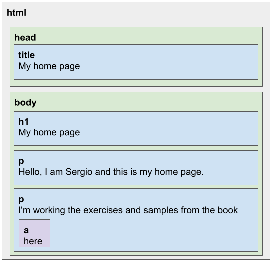

# Chapter 14 &mdash; The Document Object Model
> selected notes, examples and exercises from chapter 14

## Notes
When you open a page in the browser, the browser retrieves the page's HTML text, parses it and builds up a model of the document structure. That model is used to draw the page on the screen.
This data structure can be read and modified using JavaScript.

### Document Object Structure

A useful metaphor for understanding an HTML model is to think of it as a nested set of boxes:

Conside the following simple HTML document:

```html
<!doctype html>
<html>
  <head>
    <title>My Home Page</title>
  </head>
  <body>
    <h1>My Home Page</h1>
    <p>Hello, I am Sergio and this is my home page.</p>
    <p>I'm working the exercises and samples from the book
      <a href="https://eloquentjavascript.net">here</a>.
    </p>
  </body>
</html>
```

The document will lead to the following structure:



For each box, there is an object, which we can interact with to find out things such as what HTML tag it represents and which boxes and text contains. This representations is called the *Document Object Model*, or DOM for short.

### The DOM as a Tree

Another useful mental model is to think of the DOM as a tree. Each node of the tree represents and element, and may refer to other nodes, *children*, which in tunr may have their own children.

| NOTE: |
| :---- |
| We call a data structure a tree when it has a branching structure, has no cycles (a node may not contain itself directly or indirectly), and has a single, well-defined root. In the case of the DOM, `document.documentElement` serves as the *root*. |

We will find the following types of nodes when thinking of the DOM as a tree. Element nodes represent HTML tags. These can have *child* nodes (such as `document.body`). The *child nodes* can either be *leaf nodes* (such as pieces of text), or have children of their own.

Each DOM node has a `nodeType` property, which contains a numeric code that identifies the type of the node. There are a few constant properties defined to identify these types such as `Node.ELEMENT_NODE` (code 1), `Node.TEXT_NODE` (code 3) or `Node.COMMENT_NODE`(code 8).

The following diagram depicts this model:


The leaves are text nodes, and the arrows indicate *parent-child relationships*.

### Moving through the DOM Tree

DOM nodes contain a number of links to other nearby nodes. The following diagram depicts how you can move through the document:


Every node has a `parentNode` property that points to the node it is part of (if any), and every element (node type 1) has a `childNodes` property that points to an array-like object holding its children.

| NOTE: |
| :---- |
| Some of DOM structures are poor designed. For example, the `childNodes` property is an array-like object with a `length` property and properties labeled by numbers to access the child nodes, but it is an instance of `NodeList` type and therefore, does not have other array methods such as `slice` and `map`. |

Trees are often navigated using recursive functions, on account of their structure.

The example [01 &mdash; Navigating the DOM Recursively](./01-navigating-the-dom-recursively/) illustrates how to do that.

```javascript
export default function talksAbout(node, string) {
  if (node.nodeType == Node.ELEMENT_NODE) {
    for (let i = 0; i < node.childNodes.length; i++) {
      if (talksAbout(node.childNodes[i], string)) {
        return true;
      }
    }
    return false;
  } else if (node.nodeType == Node.TEXT_NODE) {
    return node.nodeValue.indexOf(string) > -1;
  }
}
```

### Finding Elements in the DOM

Navigating through the entire DOM tree to find particular elements is often impractical. Instead, there a bunch of methods that can be used to find specific elements.

For example, to find the first link in a document, you'd use:

```javascript
let link = document.body.getElementsByTagName('a')[0];
```

All element nodes feature a `getElementsByTagName(tag)` method.

To find a specific single node, you can use the `document.getElementById(id)` instead.

```javascript
let imgNode = document.getElementById('myImageId');
console.log(imgNode.src);
```

You can also use `getElementsByClassName(className)`, which scans through the node's children to collect an array-like object with all the elements matching the given CSS class name. 

### Changing the Document

The JavaScript API for the DOM also features methods to change the document.

Nodes have a `remove()` method to remove them from their current parent node. To add a child node to an element node, we can use the `appendChild()` method which puts it at the end of the list of the existing children, or `insertBefore(nodeToInsert, existingNode)` which inserts the node given as the first argument before the node given as the second argument.

A node can exists in a document in only one place. Consider the following example:

```javascript
<p>One</p>
<p>Two</p>
<p>Three</p>
<script>
  const paragraphs = document.body.getElementsByTagName('p');
  document.body.insertBefore(paragraphs[2], paragraphs[0]); // will result in Three, One, Two

  paragraphs[0].remove(); // Three will be removed: note that we didn't have to query the DOM again, paragraphs object
                          // was updated live to make paragraphs[0] point Three rather than One!

  document.body.replaceChild(paragraphs[1], paragraphs[0]); // Remove One by Two
</script>

```

As a consequence, inserting paragraph *Three* in front of *One* will first remove *Three* from the current position and it will then be inserted at the front. All operations that insert a node will as a side effect remove it from its current position.

### Creating Nodes

Consider the following example consisting in replacing all images (identified by `` tags) in a document by the text held in their `alt` attributes.

This will involve:
+ Remove the `` tag
+ Create a new text node with the text from `alt`
+ Replace the `` node with the newly created text node

Because the object returned by methods such as `getElementsByTagName()` is a live one, you cannot start the replacement from the first image. Instead, you should either start from the last element, or create a real array that is not updated while your performing the changes.

The implementation for the first approach is as follows:

```javascript
function replaceImages() {
  const images = document.getElementsByTagName('img');

  for (let i = images.length - 1; i >= 0; i--) {
    let image = images[i];
    if (image.alt) {
      let textNode = document.createTextNode(image.alt);
      image.parentNode.replaceChild(textNode, image);
    }
  }
}
```

The implementation for the second approach is simpler:

```javascript
function replaceImages() {
  const imageNodes = [...document.body.getElementsByTagName('img')]; /* same as Array.from */
  for (const imageNode of imageNodes) {
    if (imageNode.alt) {
      const textNode = document.createTextNode(imageNode.alt);
      imageNode.parentNode.replaceChild(textNode, imageNode);
    }
  }
}
```

To create element nodes, you can use `document.createElement(tag)` which creates a new element of the given type.

### Handling Attributes

Most of the attributes can be acccessed through properties of the same name on the element's DOM object (e.g. `href` for `<a>`, `alt` for ``...).

As HTML also allows you to set custom attributes on HTML elements, the methods `getAttribute()` and `setAttribute()` are available.

| NOTE: |
| :---- |
| It is a standard practice to prefix custom attributes on HTML elements with `data-` to ensure they do not conflict with standard attributes. |

### Layout

Different types of elements are laid out differently by the browser:
+ *block elements* &mdash; those that take up the whole width of the document and are rendered on separate lines. Examples are paragraphs (`<p>`) and headings (`<h1>`).
+ *inline elements* &mdash; those that are rendered on the same line with their surrounding text. Examples are links (`<a>`) and strong (`<strong>`).

For any given document, browsers compute a layout, which gives each element a size and position based on its type and content. This layout is then used to actually draw the document on the screen.

The size and position of an element can be accessed from JavaScript.

The `offsetWidth` and `offsetHeight` properties of an element give you the space the element takes up in pixels.
The `clientWidth` and `clientHeight` properties give you the size of the space inside the element, ignoring border width.
The `getBoundingClientRect()` returns an object with `top`, `bottom`, `left` and `right` peroperties indicating the pixel positions of the sides of the element relative to the top left corner of the screen.
The `pageXOffset` and `pageYOffset` return the current horizontal and vertical scroll value, which is useful to obtain the position of an element relative to the whole document.

As laying out a document can be quite a lot of work, browser engines do not automatically update the screen everytime that you make a change, but instead work as long as they can can. When a JavaScript program asks for the position or size of element using the methods explained above, you will also be putting additional pressure on the browser engine and forcing a recomputing of the layout.

As a consequence, it is recommended to use smart techniques to prevent doing a lot of alternating DOM modifications and reading, as exemplified in the following example:

```javascript

/* naive: almost 100 ms */
const target = document.getElementById('one');
while (target.offsetWidth < 2000) {
  target.appendChild(document.createTextNode('X')); 
}

/* clever: 1 ms */
const target = document.getElementById('two');
target.appendChild(document.createTextNode('XXXXX'));
const total = Math.ceil(2000 / (target.offsetWidth / 5));
target.firstChild.nodeValue = 'X'.repeat(total);
```

In the first approach we perform constant DOM modifications and reads, which result in a very slow operation (almost 100 ms!). In the clever approach, we first calculate how many `'X'` we would need to fill up the 2000 pixels and modify the DOM just once, which makes it run in 1 ms.

### A Few Notes on Styling

We can change the styling associated with an element (such as the text color, or whether it is underlined) using the `style` attribute of the element:

```html
<p><a href=".">Normal link</a></p>
<p><a href="." style="color: green">Green link</a></p>
```

A stryle attribute may contain one or more declarations, which are a property (such as color), followed by a color and a value (such as green). When there is more than one declaration, they must be separated by semicolons as in `"color: red; border: none"`.

Many aspects of the document can be influenced by styling, even if a given inline element should be displayed as a block, or not displayed at all:

```html
This text is displayed <strong>inline</strong>,                 
<strong style="display: block;">as a block</strong>, and        
<strong style="display: none">not displayed at all</strong>.
<!-- 
This text is displayed inline,
as a block
, and .
-->
```

JavaScript code can manipulate the style of an element through the element's `style` property. The property holds an object that has properties for all possible style properties:

```javascript
const para = document.getElementById('para');
para.style.color = 'magenta';
para.style.border = '10px dashed green';
para.style['font-family'] = 'pixelated';
```

The styling system for HTML is called CSS (*Cascading Style Sheets*). A *style sheet* is a set of rules for how to style the elements in a document.
This information can be given directly on an HTML document using a `<style>` tag:

```html
<style>
  strong {
    font-style: italic;
    color: gray;
  }
</style>
<p>
  Now <strong>strong text</strong> is italic and gray. It has been styled through CSS specified within
  the HTML document on a &lt;style&gt; block. 
</p>
```

The *cascading* in the name refers to the fact that multiple such rules are combined to produce the final style for an element. For example, the final resulting style for the `<strong>` element will have `font-weight: bold` because it has been *inherited* from the default styling defined for the `<strong>` element.

When multiple rules define a value for the same property, the most recently read rule gets a higher precedence and wins. The `style` attribute is defined to have the highest precedence and always wins.


It is possible to target more things on the *CSS rules*:

```css
/* targets <strong> elements */
strong {
  font-style: italic;
  color: gray;
}

/* targets elements with class="subtle" */
.subtle {
  color: gray;
  font-size: 80%;
}

/* targets elements with id="header" */
#header {
  background: blue;
  color: white;
}

/* targets p elements with id="main" and with class="a b" */
p#main.a.b {
  margin-bottom: 20px;
}

/* targets all `<a>` elements that are direct descendants of `<p>` tags */
p > a {
  color: red;
}

/* targets all `<a>` elements that are direct/indirect descendants of `<p>` tags */
p a {
  color: green;
}

```

The precedence rule favoring the most recently defined rule applies only when the rules have the same *specificity*, which measures how precisely it describes matching elements, determined by the number and kind of element aspects it requires. For example, `p#main.a.b {...}` is more specific than `p {...}`.

The method `querySelectorAll()` defined both on the `document` object and the *element nodes*  takes a selector string like the one used to define a CSS rule and returns a `NodeList` containing all the element that it matches.

### Positioning and Animating

The `style="position: ..."` influences the layout of an element. By default it has a value of `static`, which means it will sit in its normal place in the document. When set to `relative`, the element will still take up some palce in the document, but then you will be able to use the `top` and `left` style properties to move it relative to that normal place.
When position is set to `absolute`, the element is removed from the normal document flow, so that it no longer takes up space so that it can overlap with other elements, and the `top` and `left` properties can be used to position the element relative to the top-left corner of the nearest enclosing element whose property isn't `static`, or relative to the document if no such enclosing element exists.

The function `requestAnimationFrame()` can be used to schedule the update of a document for animation purposes without blocking user actions. The function accepts as argument a function that receives the *current time* and that will be called to perform the animation.

You can have a look at the example [11 &mdash; Hello, Animations and Positioning](./11-hello-animations-and-positioning/) for further details.


## Examples and Exercises

### [01 &mdash; Navigating the DOM Recursively](./01-navigating-the-dom-recursively/)
Illustrates how recursive functions are ver useful when dealing with tree structures, like the DOM.

### [02 &mdash; Finding Elements in the DOM](./02-finding-elements-in-the-dom/)
Practising `getElementsByTagName`, `getElementById` and `getElementsByClassName`.

### [03 &mdash; Changing the DOM](./03-changing-the-dom/)
Practising how to perform changes in the DOM.

### [04 &mdash; Creating Text Nodes](./04-creating-text-nodes/)
Illustrates how to create text nodes.

### [05 &mdash; Creating Elements](./05-creating-elements/)
Illustrates how to create elements of different types through a custom utility function named `elt`.

### [06 &mdash; Handling Custom Attributes](./06-handling-custom-attributes/)
Practising how to interact with custom attributes on nodes.

### [07 &mdash; Hello, Element Positions](./07-hello-element-positions/)
Practising the methods that return an element's size and position.

### [08 &mdash; Smart DOM Read/Modify](./08-smart-dom-read-modify/)
Illustrating how constant DOM modifications/read are very slow.

### [09 &mdash; Hello, Styling](./09-hello-styling/)
Practising styles and CSS rules.

### [10 &mdash; Hello, Query Selectors](./10-hello-query-selectors/)
Practising query selectors (i.e. finding elements through CSS rules).

### [11 &mdash; Hello, Animations and Positioning](./11-hello-animations-and-positioning/)
Practising animations and positioning.

## Cheat Sheet

### Javascript API for the Browser

| Method or Property | Description |
| :----------------- | :---------- |
| `document.body` | Points to the `<body>` element of the HTML document. |
| `document.getElementById(id)` | Returns the node whose `id` matches the given one. |
| `document.querySelectorAll(cssRule)` | Returns a `NodeList` (an array-like **NOT** live object) containing all the elements in the document matching the given *CSS rule* . |
| `{node}.querySelectorAll(cssRule)` | Returns a `NodeList` (an array-like **NOT** live object) containing all the child elements of the node matching the given *CSS rule* . |
| `{node}.nodeType` | Returns a code that identifies the type of the node (e.g `1` or `Node.ELEMENT_NODE` for elements, `3` or `Node.TEXT_NODE` for text nodes, `8` or `Node.COMMENT_NODE` for comments). |
| `{node}.childNodes` | Returns a `NodeList` (an array-like live object) containing the children of the given node. |
| `{node}.nodeValue` | Returns or sets the value of the given node as a string, or `null` for the node types for which it does not provide a value. It can be used to set/get the text of an element. |
| `{node}.getElementsByTagName(tag)` | For `Node.ELEMENT_NODE` nodes, returns a `NodeList` (live array-like object) with all the direct and indirect children nodes of the given element with the given tag. |
| `{node}.getElementsByClassName(cssClass)` | For `Node.ELEMENT_NODE` nodes, returns a `NodeList` (a live array-like object) with all the direct and indirect children nodes of the given element with the given CSS class. |
| `{node}.insertBefore(newChild, existingChild)` | Inserts the node given as first argument before the node given as the second argument. |
| `{node}.remove()` | Removes a node from its current parent node. |
| `{node}.replaceChild(newChild, existingChild)` | Replaces a childNode with another one. The replaced node must be a child of the element the method is called on. |
| `{node}.parentNode` | Points to the parent of a given node. |
| `document.createTextNode(textStr)` | Returns a new Text node. |
| `document.createElement(tag)` | Returns a new Element node of the given type. |
| `{node}.appendChild(node)` | Adds the given node to the end of the list of children of the given node. |
| `{node}.getAttribute(attr)` | Returns the value of the given attribute of the node. |
| `{node}.setAttribute(attr)` | Sets the value of the given attribute of the node. |
| `{node}.offsetWidth` | Returns the width the given node takes up in pixels. |
| `{node}.offsetHeight` | Returns the height the given node takes up in pixels. |
| `{node}.getBoundingClientRect()` | Returns an object with `top`, `bottom`, `left` and `right` peroperties indicating the pixel positions of the sides of the element relative to the top left corner of the screen. |
| `pageXOffset` | Returns the current horizontal scroll value. |
| `pageYOffset` | Returns the current vertical scroll value. |
| `requestAnimationFrame(cb)` | Notifies the browser that you wish to perform an animation. It accepts a callback function that will be called when it's time to update your animation for the next repaint. The callback is passed the time at which the callback is invoked. |


### CSS/Styling Basics

| CSS/Styling Concept &nbsp;&nbsp;&nbsp;&nbsp;&nbsp;&nbsp; | Description |
| :------------------ | :---------- |
| `style="color: green"` | Sets the style of a given element with the given color property. |
| `style="display: block"` | Forces the display of an inline element (such as `<strong>`) as a block element. |
| `style="display: inline"` | Forces the display of a block element (such as `<p>`) as an inline element. |
| `style="display: none"` | Prevents a given element from being displayed. |
| `style="border: 3px solid red"` | Sets the style of a given element so that it is displayed with a red, solid bounding border of 3px. |
| `style="font-family: Pixelated"` | Sets the font-family of an element through the style property. |
| `style="font-style: italic"` | Sets the font-style of an element through the style property. |
| `style="font-weight: bold"` | Sets the font-style of an element through the style property. |
| `style="font-size: 80%"` | Sets the font-size of an element through the style property to be 80% of the default size. |
| `style="background: blue"` | Sets the background of an element to the given color. |
| `style="margin-bottom: 20px"` | Sets the bottom margin of an element to given size in pixels. |
| `style="text-align: center"` | Sets the position of the element in the center of the document. |
| `style="position: static"` | Sets the position of the element to its default position.|
| `style="position: relative"` | Sets the position of the element in a way that can be moved around using the `top` and `left` style properties with respect to its normal place. The element will still take up space. | 
| `style="position: absolute"` | Sets the position of the element in a way that can be moved around using the `top` and `left` style properties with respect to the nearest enclosing element whose property isn't `static`, or relative to the document if no such enclosing element exists. |
| `style='top: 10px; left: 50px` | Sets the position of an element whose position is not set to `static`. |
| `strong {...}` | Defines a CSS rule that will affect styling of `<strong>` element. |
| `.xyz {...}` | Defines a CSS rule that will affect styling of elements with `class="xyz"`. |
| `#xyz {...}` | Defines a CSS rule that will affect styling of elements with `id="xyz"`. |
| `p#main.a.b {...}` | Defines a CSS rule that will affect `<p>` elements with `id="main"` and `class="a b"`. |
| `p > a {...}` | Defines a CSS rule that will affect all `<a>` elements that are direct descendants of `<p>`. |
| `p > a {...}` | Defines a CSS rule that will affect all `<a>` elements that are direct/indirect descendants of `<p>`. |
| `p > .b {...}` | Defines a CSS rule that will affect all elements with `class="b"` that are direct descendants of `<p>`. |
| `p .b {...}` | Defines a CSS rule that will affect all elements with `class="b"` that are direct/indirect descendants of `<p>`. |
